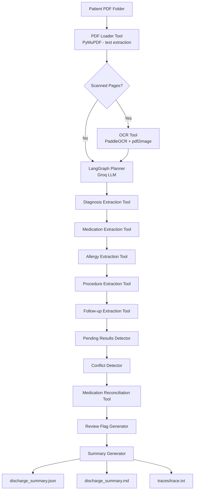

# Agentic Discharge Summary Generation System

**Dscribe (Unriddle Technologies) — AI Engineer Take-Home Assignment | Part 1**

---

## Overview

This system implements an agentic AI pipeline that ingests clinical source-note PDFs for a given patient and produces a structured, clinician-ready discharge summary draft. The agent extracts diagnoses, medications, allergies, procedures, and follow-up instructions; reconciles medications across admission and discharge; detects inter-document conflicts; identifies pending investigations; and generates graded review flags — all without fabricating or inferring undocumented clinical information.

The implementation is built on **LangGraph** for agent orchestration, **Groq API** (LLaMA 3.3 70B) for LLM inference, **FastAPI** for the HTTP interface, and **PaddleOCR + PyMuPDF** for document ingestion.

---

## Architecture



---

## Tech Stack

| Component | Technology |
|---|---|
| Language | Python 3.10 |
| Agent Framework | LangGraph + LangChain |
| LLM | Groq API — LLaMA 3.3 70B Versatile |
| API Server | FastAPI + Uvicorn |
| PDF Extraction | PyMuPDF (fitz) |
| OCR | PaddleOCR + pdf2image |
| Data Validation | Pydantic v2 |
| Retry Logic | Tenacity |
| Terminal Output | Rich |

---

## Project Structure

```
discharge_summary_agent/
├── agent/
│   ├── state.py          # AgentState TypedDict — shared across all nodes
│   ├── planner.py        # LLM-driven planner with rule-based fallback
│   └── graph.py          # LangGraph StateGraph — 12 nodes + routing
├── app/
│   └── api.py            # FastAPI — POST /generate-summary, GET /health
├── data/
│   └── create_sample_data.py
├── services/
│   └── gemini_service.py # Groq LLM wrapper with retry + test compatibility
├── tools/                # 12 extraction and analysis tools
├── tests/
│   └── test_tools.py     # 43 unit tests
└── main.py               # CLI entry point
```

---

## Agent Workflow

The agent runs as a true **plan-and-execute loop** via LangGraph. The planner node uses the LLM to decide the next tool at each step based on current extraction state, rather than following a fixed sequence. A hard iteration cap (`MAX_AGENT_STEPS`, default 25) prevents infinite loops.

**Execution sequence:**

1. Load all patient PDFs from the input folder
2. Extract text via PyMuPDF; route scanned pages to PaddleOCR
3. Planner determines the first tool based on available document text
4. Run extraction tools in planner-determined order:
   - Diagnoses, hospital course, and demographics
   - Admission and discharge medications
   - Allergy history
   - Procedures performed
   - Follow-up instructions and appointments
5. Detect pending investigations (labs, imaging, cultures awaiting results)
6. Detect inter-document conflicts (contradictions across source notes)
7. Reconcile medications — classify each as added, removed, modified, or unchanged
8. Generate graded review flags (CRITICAL / WARNING / INFO)
9. Assemble structured discharge summary
10. Save JSON, Markdown, and step trace to `outputs/{patient_id}/`

---

## No-Fabrication Guardrail

**The system never invents, infers, or hallucinate clinical data.**

This is enforced at three independent layers:

**1. Prompt-level instruction** — every extraction prompt contains an explicit rule:
> "If a piece of information is not present in the documents, return the string `NOT DOCUMENTED` for that field. Never guess, infer, or fabricate."

**2. Code-level normalisation** — every tool post-processes its LLM response. Any field returned as `None`, an empty string, or absent from the JSON is replaced with `"NOT DOCUMENTED"` before being written to state.

**3. Review flag escalation** — the Review Flag Generator scans every clinical field. Any `NOT DOCUMENTED` value generates a flag with the appropriate severity:

| Field | Severity |
|---|---|
| Allergies | CRITICAL |
| Principal diagnosis | CRITICAL |
| Discharge medications | CRITICAL |
| Patient identity | CRITICAL |
| Admission / discharge dates | WARNING |
| Follow-up instructions | WARNING |
| Any other undocumented field | INFO |

Conflicting values across documents are never auto-resolved. Both values are preserved with source attribution, and a WARNING or CRITICAL flag is raised for clinician review.

---

## Failure Handling

| Failure Scenario | Behaviour |
|---|---|
| LLM API timeout or error | Tenacity retries 3× with exponential backoff (5s → 10s → 20s) |
| LLM returns invalid JSON | Code-fence stripping + JSON parse retry; fallback `{}` on final failure |
| Missing or empty PDF | Logged as non-fatal error; agent continues with remaining documents |
| Corrupted PDF | Document marked `success=False`; excluded from extraction; run continues |
| OCR dependency unavailable | PaddleOCR import failure caught; document retained with available text |
| Agent exceeds step cap | Planner routes immediately to Summary Generator; partial summary produced |
| Tool raises unexpected exception | Caught; appended to `state.errors`; agent continues to next tool |

The agent never terminates with an unhandled exception. A partial summary with `NOT DOCUMENTED` fields and appropriate review flags is always produced.

### Groq Free-Tier Rate Limits

During testing, Groq's free-tier rate limits were occasionally encountered under high request volumes. These are handled transparently:

- Tenacity retry logic automatically waits and retries affected calls
- If retries are exhausted, the tool returns its fallback value and the agent continues
- Affected fields appear as `NOT DOCUMENTED` with corresponding review flags
- The step trace records which tools encountered API limits

Quota exhaustion is an external API constraint, not an agent failure. The system's non-fabrication and fallback architecture ensures safety is preserved regardless of LLM availability.

---

## API

```
POST /generate-summary
Content-Type: application/json

{
  "patient_folder_path": "data/patient_001",
  "patient_id": "P001",
  "max_steps": 25
}
```

```
GET /health
→ { "status": "ok", "graph_ready": true }
```

Start the server:
```bash
python main.py serve
# Interactive docs: http://127.0.0.1:8000/docs
```

---

## Quick Start

```bash
# 1. Install dependencies
pip install -r requirements.txt

# 2. Configure environment
cp .env.example .env
# Set GROQ_API_KEY=gsk_... (free at https://console.groq.com/)

# 3. Generate synthetic test data
python main.py sample-data

# 4. Run on a patient
python main.py run --patient-folder data/patient_001 --patient-id P001

# 5. Run tests
python main.py test
```

---

## Testing Results

```
43 passed, 0 failed
```

Test coverage includes:

- PDF loader with mock `fitz` — document type classification, missing folder handling, corrupted PDF resilience
- OCR tool — scanned document detection, fallback behaviour
- All extraction tools — `NOT DOCUMENTED` enforcement, error resilience, output schema validation
- Medication reconciliation — added / removed / modified detection via local diff
- Review flag generator — CRITICAL flag on missing allergies, no false positives on complete state
- Summary generator — all 15 required JSON sections present, no `null` values in output
- End-to-end smoke test — graph builds and runs without API key

**Integration runs (synthetic data):**

| Patient | Scenario | Result |
|---|---|---|
| patient_001 | Clean T2DM case | Summary generated; pending HbA1c detected; review flags produced |
| patient_002 | Complex cardiac case | Conflicts detected; missing medications flagged; pending cultures identified |

---

## Output Format

Each run produces three files under `outputs/{patient_id}/`:

**`discharge_summary.json`** — 15-section structured summary including patient demographics, diagnoses, medications, procedures, follow-up, pending results, conflicts, and review flags.

**`discharge_summary.md`** — Human-readable Markdown formatted for clinical review.

**`traces/trace.txt`** — Numbered step-by-step agent trace recording timestamp, tool selected, planner reasoning, inputs, outputs, and decision at each step. Designed for auditability and debugging.

---

## Part 2

Part 2 was not implemented. This submission focuses entirely on the core Part 1 requirements.

---

## Limitations

- **OCR quality** is dependent on source document scan resolution and handwriting legibility. Low-quality scans produce degraded extraction results.
- **LLM extraction quality** is bounded by document clarity and completeness. Ambiguous or abbreviated clinical notes may yield `NOT DOCUMENTED` fields.
- **Synthetic test data** was used for all validation runs. Real-world clinical documents may have structural variations not covered by current document-type heuristics.
- **Long documents** are truncated at 28,000 characters before LLM submission. Multi-day inpatient records with extensive progress notes may lose mid-document content.
- **No drug interaction checking** — medication reconciliation identifies undocumented changes but does not assess pharmacological risk.
- **Single-threaded API** — the FastAPI server processes one request at a time. Production deployment would require a task queue for concurrent use.

---

## Future Improvements

Given additional time, the following would be prioritised:

- **Stronger document classification** — replace filename heuristics with an LLM-based classifier that reads document content to determine type
- **Medication normalisation** — map free-text drug names to a standard formulary (RxNorm / SNOMED) before reconciliation to improve matching accuracy
- **Human-in-the-loop review UI** — a lightweight web interface for clinicians to accept, edit, or flag individual summary fields before finalisation
- **Clinical terminology standardisation** — map extracted diagnoses to ICD-10 codes and procedures to CPT codes
- **Evaluation framework** — collect (source notes, verified summary) pairs from clinicians and compute field-level extraction accuracy metrics to guide model and prompt improvements

---

## Conclusion

This system is designed around three non-negotiable properties: **safety**, **traceability**, and **non-fabrication**.

Every clinical field is either sourced directly from a document or explicitly marked as `NOT DOCUMENTED` — the agent never fills gaps with guesses. Every inter-document contradiction is surfaced to the clinician without resolution. Every agent decision is recorded in a step trace. Review flags are graded by severity so that the most critical gaps receive immediate attention.

The result is a system that functions as a disciplined clinical scribe: it organises and surfaces information reliably, escalates uncertainty transparently, and defers all judgment to the clinician.
